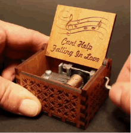
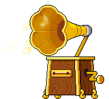

# RWKV Based Music Generator

A 046211 - Deep Learning course final project at Technion's ECE faculty.  

 

This project modifies an existing [LSTM-based model architecture](https://github.com/SudharshanShanmugasundaram/Music-Generation) designed to generate piano music and changes the architecture to use an RWKV model over the LSTM.  
The architecture comparison is based on the validation loss achieved and the quality of the music they generate.

## Agenda

- [Project Overview](#project-overview)
- [RWKV Music Generator Model Architecture](#rwkv-music-generator-model-architecture)
- [RWKV Model Compared To LSTM Based Modoel](#rwkv-music-generator-model-architecture)
- [Installation](#installation)
- [Usage](#usage)
- [Acknowledgements](#acknowledgements)
- [Contact](#contact)

## Project Overview

TL;DR - This project modifies an existing [LSTM-based model architecture](https://github.com/SudharshanShanmugasundaram/Music-Generation.git)  designed to generate piano music and changes the architecture to use an RWKV model over the LSTM. The RWKV model achieved better validation loss, and the generated music sounds better (at least to us:wink:).

### Baseline: LSTM-based Generator
#### LSTM - Long Short-Term Memory
* Long short-term memory (LSTM) is a type of recurrent cell that tries to preserve long-term information. The idea of LSTM was presented in 1997 but flourished in the age of deep learning.\n",
    * LSTM introduces a memory cell with the same shape as the hidden state, engineered to record additional information.
    * The memory is controlled by 3 main gates: 
        * **Input gate**: decides when to read data into the cell.
        * **Output gate**: outputs the entries from the cell.
        * **Forget gate**: a mechanism to reset the content of the cell.
    * These gates learn which information is relevant to forget or remember during the training process. The gates contain a sigmoid activation function.

* Suppose that there are $h$ hidden units, the batch size is $n$, and the number of inputs is $d$. Thus, the input is $X_t\\in \\mathbb{R}^{n\\times d}$ (number of examples: $n$, number of inputs: $d$) and the hidden state of the previous time step is $H_{t-1}\\in\\mathbb{R}^{n\\times h}$ (number of hidden units: $h$). We define the following at timestep $t$:
  * **Input gate**: $$I_t = \\sigma(X_tW_{xi} +H_{t-1}W_{hi} +b_i) \\in \\mathbb{R}^{n\\times h}$$
  * **Forget gate**: $$F_t = \\sigma(X_tW_{xf} +H_{t-1}W_{hf} +b_f) \\in \\mathbb{R}^{n\\times f}$$
  * **Output gate**: $$O_t = \\sigma(X_tW_{xo} +H_{t-1}W_{ho} +b_o) \\in \\mathbb{R}^{n\\times o}$$
[ Taken from [ee046211-deep-learning tutorial 07](https://github.com/taldatech/ee046211-deep-learning/blob/e74644e4ae206207dc1de037dee2d0fe9c93fb89/ee046211_tutorial_07_sequential_tasks_rnn.ipynb) ]

#### LSTM Music Generator Model Architecture
* The architecture used for Piano Music Generation is a conditional character-level language model based on LSTM cells.
* The model is trained over part of the [Nottingham dataset](https://paperswithcode.com/dataset/nottingham) which consists of piano songs represented as piano pitches matrice and time-frequency matrice.
* So the model needs to predict:
   *  The next pitches based on the previously played pitches
   *  The Time-Frequency matrice ("How long the pitch is pressed")
* After the training over the dataset, we can sample from the model - make it compose new music.
  [ More about the model - [Blog](http://warmspringwinds.github.io/pytorch/rnns/2018/01/27/learning-to-generate-lyrics-and-music-with-recurrent-neural-networks/), [GitHub](https://github.com/SudharshanShanmugasundaram/Music-Generation) ]

### RWKV Music Generator Model Architecture
#### RWKV - Receptence, Weight, Key, and Value
* RWKV is an attention-free, parallelizable RNN, which reaches transformer-level language model performance.
* Using channel-mixing and Time-mixing it imitates the attention mechanism.

## Installation

Provide step-by-step instructions on how to install and set up the project. Include any prerequisites, dependencies, or environment setup required. You can use bullet points or code blocks to provide clear instructions.

## Usage

Provide examples and instructions on how to use the project. Explain the different components, modules, or functions available and how they can be utilized. Include code snippets or command examples if applicable.

## Acknowledgements

Acknowledge and give credit to any individuals, organizations, or open-source projects that have contributed to the project or influenced its development. Mention any external resources, references, or research papers that were used or referred to during the project.

## Contact

Provide contact information for the project maintainer or team. Include an email address or a link to a contact form. Optionally, you can include links to social media profiles or a dedicated project website.

