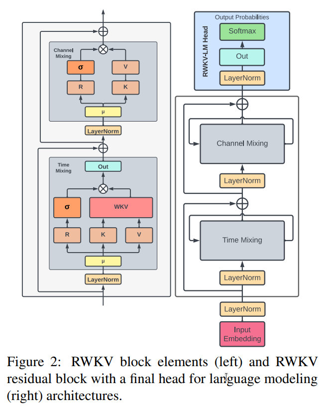
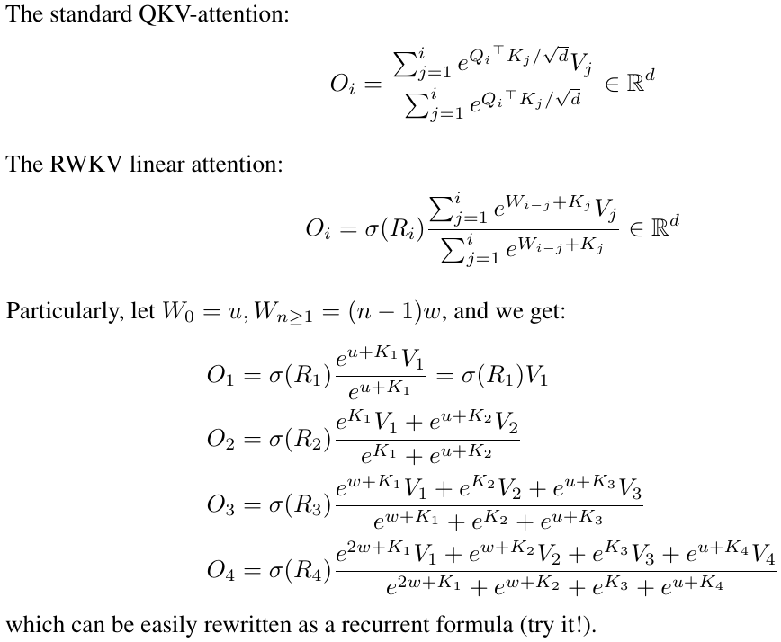
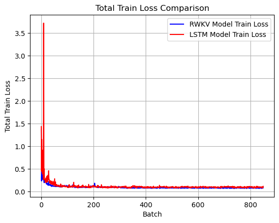
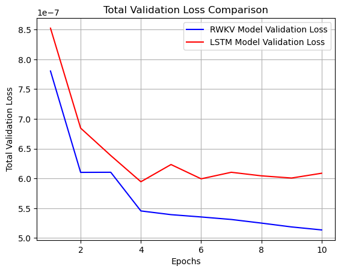

# RWKV Based Music Generator

A 046211 - Deep Learning course final project at Technion's ECE faculty.  
[Liad Perl](https://www.linkedin.com/in/liad-perl-a925551b7/) and [Ariel Suller](https://www.linkedin.com/in/ariel-suller-23300214b/)

 

This project modifies an existing [LSTM-based model architecture](https://github.com/SudharshanShanmugasundaram/Music-Generation) designed to generate piano music and changes the architecture to use an RWKV model over the LSTM.  
The architecture comparison is based on the validation loss achieved and the quality of the music they generate.

## Agenda

- [Project Overview](#project-overview)
- [RWKV Music Generator Model Architecture](#rwkv-music-generator-model-architecture)
- [RWKV Model Compared To LSTM Based Modoel](#rwkv-music-generator-model-architecture)
- [Installation](#installation)
- [Usage](#usage)
- [Acknowledgements](#acknowledgements)
- [Contact](#contact)

## Project Overview

TL;DR - This project modifies an existing [LSTM-based model architecture](https://github.com/SudharshanShanmugasundaram/Music-Generation.git)  designed to generate piano music and changes the architecture to use an RWKV model over the LSTM. The RWKV model achieved better validation loss, and the generated music sounds better (at least to us:wink:).

### Baseline: LSTM-based Generator
#### LSTM - Long Short-Term Memory
* Long short-term memory (LSTM) is a type of recurrent cell that tries to preserve long-term information. The idea of LSTM was presented in 1997 but flourished in the age of deep learning.\n",
    * LSTM introduces a memory cell with the same shape as the hidden state, engineered to record additional information.
    * The memory is controlled by 3 main gates: 
        * **Input gate**: decides when to read data into the cell.
        * **Output gate**: outputs the entries from the cell.
        * **Forget gate**: a mechanism to reset the content of the cell.
    * These gates learn which information is relevant to forget or remember during the training process. The gates contain a sigmoid activation function.

* Suppose that there are $h$ hidden units, the batch size is $n$, and the number of inputs is $d$. Thus, the input is $X_t\\in \\mathbb{R}^{n\\times d}$ (number of examples: $n$, number of inputs: $d$) and the hidden state of the previous time step is $H_{t-1}\\in\\mathbb{R}^{n\\times h}$ (number of hidden units: $h$). We define the following at timestep $t$:
  * **Input gate**: $$I_t = \\sigma(X_tW_{xi} +H_{t-1}W_{hi} +b_i) \\in \\mathbb{R}^{n\\times h}$$
  * **Forget gate**: $$F_t = \\sigma(X_tW_{xf} +H_{t-1}W_{hf} +b_f) \\in \\mathbb{R}^{n\\times f}$$
  * **Output gate**: $$O_t = \\sigma(X_tW_{xo} +H_{t-1}W_{ho} +b_o) \\in \\mathbb{R}^{n\\times o}$$
[ Taken from [ee046211-deep-learning tutorial 07](https://github.com/taldatech/ee046211-deep-learning/blob/e74644e4ae206207dc1de037dee2d0fe9c93fb89/ee046211_tutorial_07_sequential_tasks_rnn.ipynb) ]

#### LSTM Music Generator Model
* The architecture used for Piano Music Generation is a conditional character-level language model based on LSTM cells.
* The model is trained over part of the [Nottingham dataset](https://paperswithcode.com/dataset/nottingham) which consists of piano songs represented as piano pitches matrice and time-frequency matrice.
* So the model needs to predict:
   *  The next pitches based on the previously played pitches
   *  The Time-Frequency matrice ("How long the pitch is pressed")
* After the training over the dataset, we can sample from the model - make it compose new music.
  [ More about the model - [Blog](http://warmspringwinds.github.io/pytorch/rnns/2018/01/27/learning-to-generate-lyrics-and-music-with-recurrent-neural-networks/), [GitHub](https://github.com/SudharshanShanmugasundaram/Music-Generation) ]

### RWKV-based Generator
#### RWKV - Receptence, Weight, Key, and Value
* Presented in the paper [RWKV: Reinventing RNNs for the Transformer Era](https://arxiv.org/abs/2305.13048)
* Traditional RNN models are unable to utilize very long contexts. However, RWKV can utilize thousands of tokens and beyond.
*  Traditional RNN models cannot be parallelized when training. RWKV is similar to a “linearized GPT” and it trains faster than GPT.
* RWKV is an attention-free, parallelizable RNN, which reaches transformer-level language model performance.
* Using channel-mixing and Time-mixing it imitates the attention mechanism. From the paper:

#### RWKV Music Generator Model
* All RWKV repositories we have found were used to generate text (sort of a ChatGPT).
   * None of those repos' had an architecture designed to get a two-dimensional input like our input (as described in [LSTM Music Generator Model Architecture](#lstm-music-generator-model-architecture) ).
* Our Main challenge was to take an existing RWKV model and adapt it to get and return the two matrices described
* In order to do so, we took RWKV-v4neo from [BlinkDL/RWKV-LM](https://github.com/BlinkDL/RWKV-LM)
* First - "take out" the LSTM and replace it with the RVKV head - and make it work over the cuda.
   * Took time 
* Adapt the RWKV model to the Nottingham data:
   * Instead of the inner embedding layer we are using a linear layer with vocabulary size input and embedding size output
      * It was done because the input to the model is an embed of data
         * And anyway - the embedded performed was not good for this mission
         * And we did not want to embed twice
* Finally - Train the model and sample music.
* Got better results as described in the next part. 

## Performance Comparison
### Losses Comparison 
* Training the models over Nottingham Dataset for 10 epochs achieved the following results:

* The RWKV model achieves a significantly better loss score over the validation set than the LSTM-based model.
* It can be also seen that the train loss is a bit lower for the RWKV. The RWKV constantly got lower loss over the first epoch.

### Quality Comparison
* Comparing the results by hearing the generated music.
* The LSTM-based model generated the following melody:
  

## Installation

Provide step-by-step instructions on how to install and set up the project. Include any prerequisites, dependencies, or environment setup required. You can use bullet points or code blocks to provide clear instructions.

## Usage

Provide examples and instructions on how to use the project. Explain the different components, modules, or functions available and how they can be utilized. Include code snippets or command examples if applicable.

## Acknowledgements

Acknowledge and give credit to any individuals, organizations, or open-source projects that have contributed to the project or influenced its development. Mention any external resources, references, or research papers that were used or referred to during the project.

## Contact

Provide contact information for the project maintainer or team. Include an email address or a link to a contact form. Optionally, you can include links to social media profiles or a dedicated project website.

